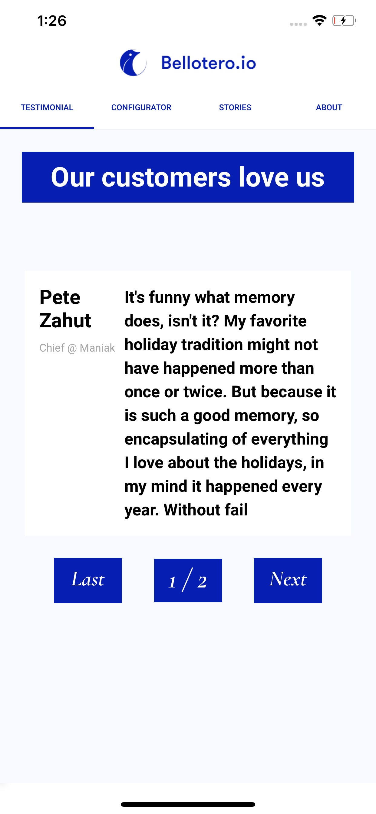
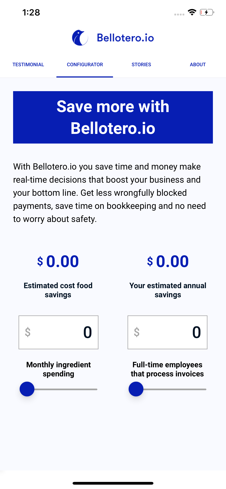

# Bellotero

**Bellotero is a simple calculator app, built in with expo, react native, redux, redux-thunk**

With Bellotero.io you save time and money make real-time decisions that boost your business and your bottom line. Get less wrongfully blocked payments, save time on bookkeeping, and no need to worry about safety.

## Instalation
1. install expo: `npm install --global expo-cli`
2. clone the repo: `git clone https://github.com/hackemateninja/Bellotero`
3. `cd Bellotero`
4. install dependencies: `expo install`
5. run the project: `expo start`

## Live demo

You can view the demo downloading the expo app and scanning the QR code
this will show the app on you mobile device

